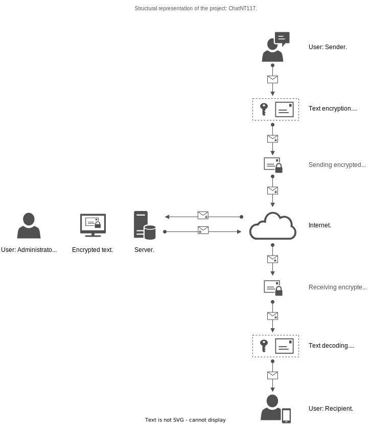
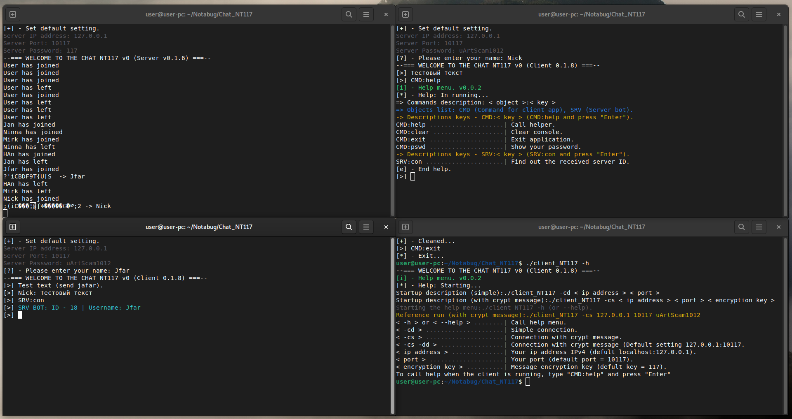

<h1 align="center">Hi there, I`m,
	<a href="https://notabug.org/Nick_Kramer" target="_blank">
	Nick Kramer.
	</a> 
</h1>

<h3 align="center"> Porject: Chatroom NT117. </h3>

	*Description: Client-server application for uplinking network chat. 
		      This project is in its early stages.

`LICENCIA` = **GPLv3**.

### How to build it all up?

Start by cloning the repository.
    $ git clone https://notabug.org/Nick_Kramer/Chat_NT117.git
    
Run the make command (in the repository directory).
    $ make

### (Server) How do you get it up and running?

Start the server with the parameters: Host ip address and port.
    $ ./server_NT117 <host ip address> <host port>
    
Start the server with the parameter: Host ip address (default use port 10117).
    $ ./server_NT117 <host ip address> 
    
Local server start-up (default use localhost/127.0.0.1 and port 10117).
    $ ./server_NT117
  
### (Client) How do you get it up and running?
 
 Run the client with the following parameters: option key, host ip address, host port, secret key.
     $ ./client_NT117 < option key > < host ip address > < host port > < secret key >
     
 Call help.
     $ ./client_NT117 -h
     
 Reference running (with crypt messages):
     $ ./client_NT117 -cs -dd uArtScam1012

### Command info: Client.

* CMD:help - call help.
* CMD:exit - exit client app.
* CMD:clear - clear console.
* CMD:pswd - show encryption password/key.
* SRV:con - information about me, from the server side.

### Owerview "Chatroom NT117."

 

### TODO list: Client.

x Refine text encryption/decryption methods.
x Add a helper.
* Add the ability to write only one user.
* Add ability to change encryption keys in runtime mode.
* Create themes (text selections) for the console.

### TODO list: Server.

* Obtaining a key, to access the server.
* Create a list of users.
* Refinement SRV bot - ping, information about users.

### Screenshot testing ChatroomNT117

 
